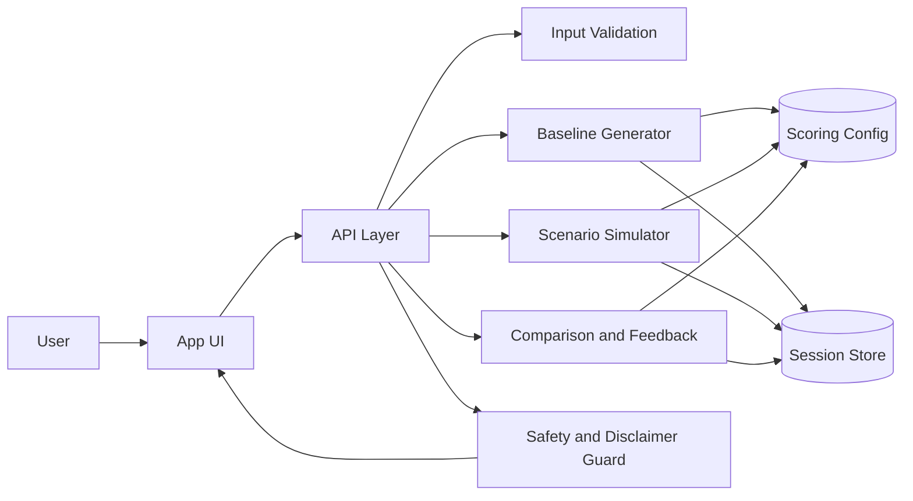
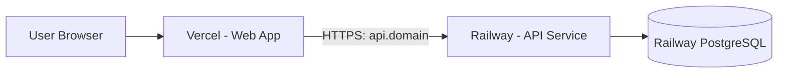

# Personalized Digital Twin Health App - Simple Block Diagram

## Quick View

```text
User -> App UI -> API Layer -> Core Services -> Data Stores
                              -> Safety Guard -> Final Output
```

## Mermaid Block Diagram



## Deployment View (Vercel + Railway)


