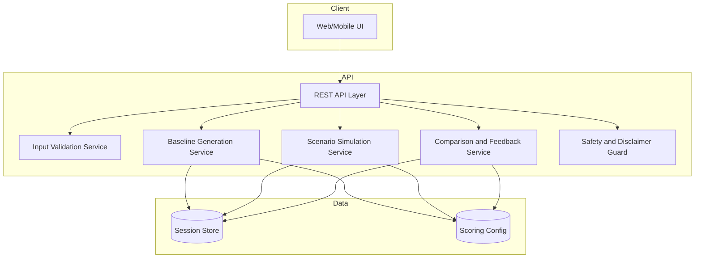

# Personalized Digital Twin Health App - Design Document

## Overview

This document defines the technical design for the Personalized Digital Twin Health App.

The application is an educational simulation tool that lets users model how lifestyle changes may influence overall health trends. It creates a baseline digital twin state from user inputs, supports multiple what-if scenarios, and compares each scenario against baseline.

The system is explicitly non-diagnostic and must not provide medical diagnosis, treatment advice, or prescriptions.

## Goals and Scope

### In Scope

- Collect structured lifestyle inputs.
- Generate a baseline health trend state.
- Simulate multiple what-if scenarios.
- Show relative change, trend direction, and deviation from baseline.
- Present plain-language feedback and simple visual cues.
- Include clear educational-use disclaimer.

### Out of Scope

- Clinical diagnosis or disease detection.
- Personalized medical treatment recommendations.
- Use of real patient medical records.
- Claims of predictive clinical outcomes.

## Architecture

### High-Level Architecture



### Infrastructure and Deployment (Website First: Vercel + Railway)

Primary hosting choice:
- Frontend website: `Vercel`
- Backend API: `Railway`
- Database: `Railway PostgreSQL`

Website-first rollout:
1. Phase 1: Deploy UI on Vercel with local/mock data so the product is usable early.
2. Phase 2: Deploy API service on Railway and connect Vercel UI using `NEXT_PUBLIC_API_URL`.
3. Phase 3: Add Railway PostgreSQL persistence and migrate from in-memory session storage.

Environment topology:
- `development`: local UI + local API + local DB
- `preview/staging`: Vercel preview deployment + Railway staging API/DB
- `production`: Vercel production + Railway production API/DB

Domain plan:
- `app.<domain>` -> Vercel frontend
- `api.<domain>` -> Railway backend

Networking and integration constraints:
- Browser traffic must call a public API domain (`api.<domain>`).
- Railway private networking is internal to Railway services and not directly reachable from browsers.
- Keep Vercel and Railway in the same region where possible to reduce latency.

Runtime/deployment assumptions:
- Frontend uses Node-compatible build on Vercel.
- API service must bind to Railway-provided `PORT`.
- API must expose `/health` for Railway health checks.

Configuration and secrets:
- Vercel env vars:
  - `NEXT_PUBLIC_API_URL`
  - Any non-public app secrets required by frontend runtime
- Railway env vars:
  - `DATABASE_URL`
  - API-side secrets (tokens, CORS allowlist, etc.)

CI/CD flow:
1. Push to feature branch -> Vercel preview + Railway staging deploy.
2. Validate UI/API integration in preview/staging.
3. Merge to main -> Vercel production + Railway production deploy.

### Design Principles

1. Educational, not clinical: all outputs are framed as relative trend simulations.
2. Deterministic and explainable: score and trend logic is rule-based and auditable.
3. Privacy-first: store minimal user data and avoid patient medical records.
4. Fast scenario iteration: support interactive what-if comparisons with low latency.
5. Plain language output: feedback is understandable for non-technical users.

## Components and Interfaces

### 1. Input Validation Service

Validates required and optional profile inputs before baseline or scenario generation.

```typescript
type AgeRange =
  | '13-17'
  | '18-25'
  | '26-35'
  | '36-45'
  | '46-55'
  | '56-65'
  | '66+'

type BodyCategory = 'underweight' | 'healthy' | 'overweight' | 'obese'
type ActivityLevel = 'sedentary' | 'light' | 'moderate' | 'high'
type DietCategory = 'poor' | 'average' | 'balanced'
type HealthConditionCategory = 'poor' | 'fair' | 'good'
type MedicationAdherence = 'adherent' | 'partial' | 'non_adherent'
type StressLevel = 'low' | 'moderate' | 'high' | 'acute'

interface LifestyleInput {
  ageRange: AgeRange
  bodyCategory: BodyCategory
  sleepHours: number
  activityLevel: ActivityLevel
  dietCategory: DietCategory
  healthConditionCategory: HealthConditionCategory
  medicationAdherence?: MedicationAdherence
  stressLevel?: StressLevel
}

interface ValidationResult {
  valid: boolean
  errors: Array<{ field: string; message: string }>
}
```

Validation rules:
- Required fields must be present.
- `sleepHours` must be in range `0..24`.
- Optional fields are accepted when provided and validated against enums.

### 2. Baseline Generation Service

Builds the baseline twin state from validated input.

```typescript
interface BaselineState {
  baselineId: string
  input: LifestyleInput
  relativeScore: number // 0..100 educational index
  factorScores: Record<string, number>
  trendLabel: 'improving' | 'stable' | 'declining'
  generatedAt: string
  disclaimer: string
}

interface BaselineService {
  generateBaseline(input: LifestyleInput): BaselineState
}
```

Behavior:
- Computes normalized factor scores from categorical mappings.
- Produces a baseline relative score and a default trend label of `stable`.
- Persists baseline as comparison anchor.

### 3. Scenario Simulation Service

Creates and evaluates what-if scenario variants without mutating the baseline input.

```typescript
interface ScenarioInput {
  scenarioName: string
  overrides: Partial<LifestyleInput>
}

interface ScenarioResult {
  scenarioId: string
  scenarioName: string
  effectiveInput: LifestyleInput
  relativeScore: number
  deltaFromBaseline: number
  deviationPercent: number
  trendDirection: 'improving' | 'stable' | 'declining'
  generatedAt: string
  disclaimer: string
}

interface ScenarioService {
  runScenario(baseline: BaselineState, scenario: ScenarioInput): ScenarioResult
  runBatch(baseline: BaselineState, scenarios: ScenarioInput[]): ScenarioResult[]
}
```

Behavior:
- Applies only supplied overrides.
- Supports multiple scenarios per baseline.
- Recomputes twin state after each modification.
- Keeps scenario evaluations independent.

### 4. Comparison and Feedback Service

Produces user-facing outputs comparing baseline vs scenarios.

```typescript
interface ComparisonViewModel {
  baselineScore: number
  scenarios: Array<{
    scenarioId: string
    scenarioName: string
    score: number
    delta: number
    trendDirection: 'improving' | 'stable' | 'declining'
    cue: 'up' | 'flat' | 'down'
    summary: string
  }>
  disclaimer: string
}

interface FeedbackService {
  compare(baseline: BaselineState, scenarios: ScenarioResult[]): ComparisonViewModel
}
```

Output requirements:
- Relative change compared to baseline.
- Trend direction (improving/stable/declining).
- Deviation from baseline.
- Text summary plus simple visual cue (`up`, `flat`, `down`).

### 5. Safety and Disclaimer Guard

Ensures all responses remain educational and non-diagnostic.

```typescript
interface SafetyGuard {
  enforceDisclaimer(text: string): string
  blockClinicalAdvice(text: string): string
}
```

Guard rules:
- Attach disclaimer to every baseline, scenario, and comparison output.
- Filter or reject phrases that imply diagnosis, treatment, or prescription.

## Scoring and Simulation Logic

The model is rule-based and uses generalized mappings, not clinical datasets.

### Factor Mapping

Each input maps to a factor score in `0..1`.

Example mapping approach:
- Sleep: strongest near recommended range, lower at extremes.
- Activity and diet: higher categories score better.
- Optional medication adherence and stress adjust score up/down when present.

### Relative Score Formula

```text
relativeScore = 100 * weighted_sum(factorScores)
```

Example weights (configurable):
- Sleep: 0.25
- Activity: 0.25
- Diet: 0.20
- Body category: 0.10
- General health condition: 0.10
- Age range: 0.05
- Medication adherence: 0.03 (if present)
- Stress level: 0.02 (if present)

Weights are normalized when optional fields are missing.

### Trend Direction Rules

Given `delta = scenarioScore - baselineScore`:
- `delta >= +3.0`: `improving`
- `-3.0 < delta < +3.0`: `stable`
- `delta <= -3.0`: `declining`

Deviation:

```text
deviationPercent = abs(delta) / max(baselineScore, 1) * 100
```

## API Design

### Endpoints

- `POST /v1/baseline`
  - Input: `LifestyleInput`
  - Output: `BaselineState`

- `POST /v1/scenarios/run`
  - Input: `{ baselineId, scenarios: ScenarioInput[] }`
  - Output: `ScenarioResult[]`

- `POST /v1/scenarios/compare`
  - Input: `{ baselineId, scenarioIds: string[] }`
  - Output: `ComparisonViewModel`

- `GET /v1/disclaimer`
  - Output: `{ text: string }`

### API Error Model

```typescript
interface ApiError {
  code: 'VALIDATION_ERROR' | 'NOT_FOUND' | 'SAFETY_VIOLATION' | 'INTERNAL_ERROR'
  message: string
  details?: Record<string, string>
  timestamp: string
}
```

## Data Model and Storage

Storage is minimal and educational-use focused.

```typescript
interface TwinSession {
  sessionId: string
  baseline: BaselineState
  scenarios: ScenarioResult[]
  createdAt: string
  updatedAt: string
}
```

Data handling constraints:
- Do not store patient medical records.
- Do not require real identity fields (name, full DOB, address).
- Keep only simulation inputs and computed relative outputs.

## Non-Functional Design

### Safety and Ethics

- Educational disclaimer appears in UI and API outputs.
- Diagnostic and treatment language is blocked by output guard.
- Documentation clearly states non-clinical nature of model.

### Usability

- Inputs use clear labels and constrained options.
- Output summaries are plain-language and concise.
- Comparison view emphasizes baseline vs scenario deltas.

### Performance

- Target: scenario simulation response <= 2 seconds for standard batches.
- Strategy:
  - In-memory scoring for fast deterministic computation.
  - Preloaded scoring configuration.
  - Batch scenario evaluation in a single call.

## Error Handling

Error classes:
1. Validation errors: missing/invalid fields.
2. Scenario errors: unknown baseline or invalid overrides.
3. Safety errors: output text violates non-diagnostic policy.
4. System errors: unexpected runtime failures.

Response behavior:
- Return structured error with field-specific details.
- Never return partial clinical-sounding guidance.
- Preserve baseline state if scenario evaluation fails.

## Testing Strategy

### Unit Tests

- Input validation rules for each field.
- Baseline score calculation and factor normalization.
- Scenario override merge and isolation.
- Trend classification thresholds.
- Disclaimer enforcement and safety filter behavior.

### Integration Tests

- Baseline creation -> scenario batch -> comparison workflow.
- Optional fields present/absent behavior.
- Multi-scenario comparison output ordering and consistency.

### Performance Tests

- Batch simulation latency under 2 seconds for expected scenario volume.
- Repeated simulation stability and memory usage checks.

### Content Safety Tests

- Ensure all outputs include disclaimer text.
- Ensure prohibited diagnostic/treatment phrases are blocked.

## Requirements Traceability

- SRS 3.1 User Input -> Input Validation Service, `LifestyleInput` model
- SRS 3.2 Baseline Generation -> Baseline Generation Service
- SRS 3.3 Scenario Simulation -> Scenario Simulation Service
- SRS 3.4 Output and Feedback -> Comparison and Feedback Service
- SRS 4.1 Safety and Ethics -> Safety Guard, data handling constraints
- SRS 4.2 Usability -> UI and feedback design constraints
- SRS 4.3 Performance -> in-memory scoring, batch simulation, latency tests
- SRS 5 Assumptions and Limitations -> rule-based generalized model, relative outputs only
